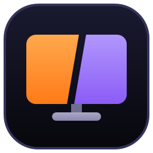

# ScreenSplit

A speedrun timer with an autosplitter that **watches the screen**. There are no game hooks, memory reading or scripts. You show it what to look for (a "Level clear" banner, a loading screen, a line of text) and it splits, starts, resets and removes loads by itself, in any game.

## Download

**[⬇ Latest release](https://github.com/Ozmao/screensplit-releases/releases/latest)**: download `ScreenSplit.exe`.

- A single file with nothing to install. It needs Windows 10 (version 2004 or newer) or Windows 11, 64-bit.
- The exe isn't code-signed yet, so Windows SmartScreen may warn the first time. Click **More info → Run anyway**.
- Settings are kept in `%APPDATA%\ScreenSplit`, and your games and splits in `Documents\ScreenSplit`.

## What it does

- **Screen-based autosplitting:** match an image, read text (OCR) or detect a loading screen. Splits are timed from the frame where the change appeared.
- **Easy setup:** freeze the last 10 seconds and scrub back to grab the exact frame, get a suggested threshold, and use a test run that logs every split and why.
- **A full timer:** PB, golds, sum of best, attempt history, Real Time and Game Time (or both at once).
- **Shareable autosplitters:** one `.screensplit` file holds a game's whole autosplitter. Double-click it and it's ready to run.
- **Compare against** PB, best segments, average segments or your latest run, with info tiles under the timer (best possible time, current pace, possible time save and more).
- **Crash recovery:** if the PC or the timer crashes mid-run, continue the run on the next start.
- **Analysis:** averages, consistency and resets for every segment, charts of your runs, and a summary after each run.
- **OBS overlay you lay out yourself:** a browser source; drag the elements into place in your web browser.
- **speedrun.com:** compare against the world record and see the category's rules next to the game.
- **Works with LiveSplit:** import your `.lss` splits, or export back to `.lss`.
- **Hotkeys on keyboard or controller:** Xbox, PlayStation, Switch Pro and most others work while the game has focus.
- **Stream-ready:** the oz-ui themes, plus a chroma-key mode for OBS.

## Getting started

Read **[HOW-TO-AUTOSPLIT.md](HOW-TO-AUTOSPLIT.md)** to set a game up from scratch. It's also attached to every release.

## Feedback

Found a bug or have an idea? [Open an issue](https://github.com/Ozmao/screensplit-releases/issues).

A Linux version is in progress.
